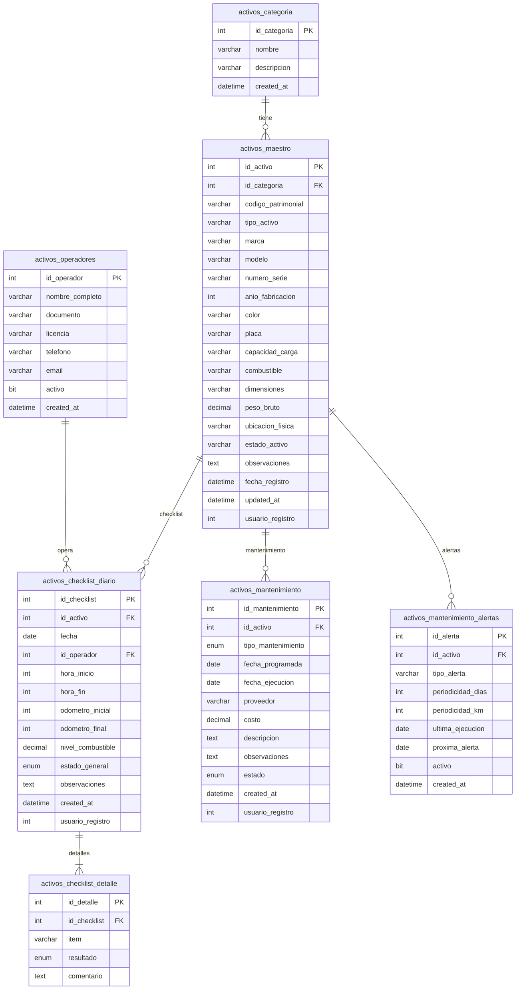
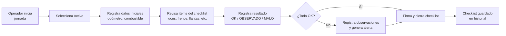
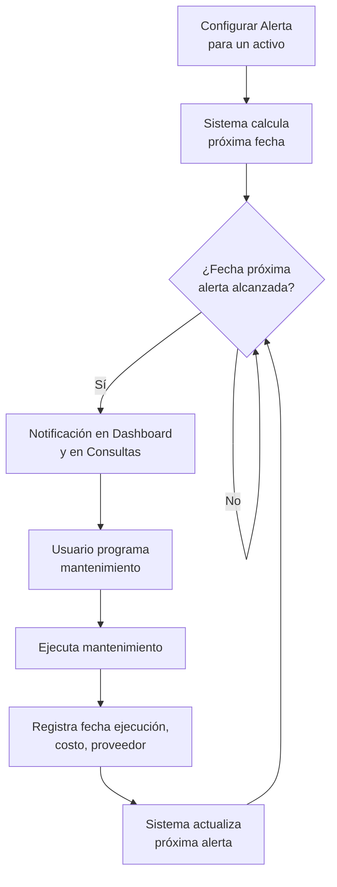

# Plan: Módulo de Control de Activos - Cadena de Suministros

## 1. Resumen Ejecutivo

Módulo para la gestión integral de **activos móviles** utilizados por el área de Cadena de Suministros. El sistema permitirá llevar un **maestro de activos**, un **checklist de uso diario** y un **control de mantenimientos** (preventivo y correctivo con alertas).

**Responsables clave:**
- **Diego Donayres Ramires** - Subgerente de Cadena de Suministros (revisor principal)
- **Paul Huaman Peña** - Encargado de Almacén

---

## 2. Arquitectura del Sistema

### 2.1 Stack Tecnológico (existente)

| Capa | Tecnología |
|------|-----------|
| Frontend | HTML5 + CSS3 + jQuery + DevExtreme 22.2 |
| Backend | PHP 8.x |
| Base de Datos | MySQL (`campoand_campoandino`) |
| Estilos | `stylespanel.css` + estilos propios del módulo |
| Conexión | `shared/conexion.php` (maneja local/remoto) |

### 2.2 Patrón de Módulo (a seguir)

Cada módulo en el sistema sigue esta estructura:

```
sistemas/control_activos/
├── maestro.php              # CRUD del maestro de activos
├── checklist.php            # Registro de checklist diario
├── mantenimiento.php        # Gestión de mantenimientos
├── consultas.php            # Consultas y reportes
├── sql_setup.sql            # Script de creación de tablas
├── api/
│   └── datos.php            # API REST (dispatcher de acciones)
└── assets/                  # (opcional) imágenes, etc.
```

### 2.3 Integración con el Panel Principal

Se agregará una nueva tarjeta `cardControlActivos` en [`public/panel.html`](../public/panel.html:343) con los botones correspondientes, controlada por **features** en [`sistemas/mantenimiento_accesos/mantenimiento_accesos.js`](../sistemas/mantenimiento_accesos/mantenimiento_accesos.js:5).

---

## 3. Modelo de Datos (MySQL)

### 3.1 Diagrama Entidad-Relación



### 3.2 Diccionario de Tablas

#### `activos_categoria`
Agrupa los activos por tipo lógico (Camión, Camioneta, Montacargas, Stocka, etc.).

| Campo | Tipo | Descripción |
|-------|------|-------------|
| `id_categoria` | INT PK AUTO_INCREMENT | ID único |
| `nombre` | VARCHAR(100) | Nombre de la categoría (Camión, Montacarga, etc.) |
| `descripcion` | VARCHAR(255) | Descripción opcional |
| `created_at` | DATETIME | Fecha de creación |

#### `activos_maestro`
Corazón del módulo. Almacena la ficha técnica de cada activo.

| Campo | Tipo | Descripción |
|-------|------|-------------|
| `id_activo` | INT PK AUTO_INCREMENT | ID único |
| `id_categoria` | INT FK | Categoría del activo |
| `codigo_patrimonial` | VARCHAR(50) | Código interno de la empresa |
| `tipo_activo` | ENUM('CAMION', 'CAMIONETA', 'MONTACARGA', 'STOCKA', 'OTRO') | Tipo específico |
| `marca` | VARCHAR(100) | Marca (Toyota, Mitsubishi, etc.) |
| `modelo` | VARCHAR(100) | Modelo específico |
| `numero_serie` | VARCHAR(100) | Número de serie del fabricante |
| `anio_fabricacion` | INT(4) | Año de fabricación |
| `color` | VARCHAR(50) | Color |
| `placa` | VARCHAR(20) | Placa (si aplica, ej: vehículos) |
| `capacidad_carga` | VARCHAR(50) | Capacidad de carga (kg, ton) |
| `combustible` | VARCHAR(50) | Tipo de combustible (Diesel, Gasolina, Eléctrico, etc.) |
| `dimensiones` | VARCHAR(100) | Dimensiones generales |
| `peso_bruto` | DECIMAL(10,2) | Peso bruto en kg |
| `ubicacion_fisica` | VARCHAR(150) | Dónde se encuentra físicamente |
| `estado_activo` | ENUM('OPERATIVO', 'EN MANTENIMIENTO', 'INOPERATIVO', 'DE BAJA') | Estado actual |
| `observaciones` | TEXT | Notas adicionales |
| `fecha_registro` | DATETIME | Cuándo se registró |
| `updated_at` | DATETIME | Última actualización |
| `usuario_registro` | INT | ID del usuario que registró |

#### `activos_checklist_diario`
Registro del checklist diario que los operadores llenan al usar un activo.

| Campo | Tipo | Descripción |
|-------|------|-------------|
| `id_checklist` | INT PK AUTO_INCREMENT | ID único |
| `id_activo` | INT FK | Activo inspeccionado |
| `fecha` | DATE | Fecha de la inspección |
| `id_operador` | INT FK | Operador que realizó la inspección |
| `hora_inicio` | INT | Hora de inicio de uso (formato HHMM) |
| `hora_fin` | INT | Hora de fin de uso (formato HHMM) |
| `odometro_inicial` | INT | Lectura inicial del odómetro/horómetro |
| `odometro_final` | INT | Lectura final del odómetro/horómetro |
| `nivel_combustible` | DECIMAL(5,2) | Nivel de combustible (%) |
| `estado_general` | ENUM('BUENO', 'REGULAR', 'MALO') | Estado general reportado |
| `observaciones` | TEXT | Observaciones del operador |
| `created_at` | DATETIME | Fecha de registro |
| `usuario_registro` | INT | ID del usuario |

#### `activos_checklist_detalle`
Cada ítem específico del checklist (luces, frenos, llantas, etc.).

| Campo | Tipo | Descripción |
|-------|------|-------------|
| `id_detalle` | INT PK AUTO_INCREMENT | ID único |
| `id_checklist` | INT FK | Checklist padre |
| `item` | VARCHAR(100) | Nombre del ítem (ej: "Luces delanteras") |
| `resultado` | ENUM('OK', 'OBSERVADO', 'MALO', 'N/A') | Resultado de la revisión |
| `comentario` | TEXT | Comentario del operador |

#### `activos_mantenimiento`
Registro de mantenimientos preventivos y correctivos.

| Campo | Tipo | Descripción |
|-------|------|-------------|
| `id_mantenimiento` | INT PK AUTO_INCREMENT | ID único |
| `id_activo` | INT FK | Activo mantenido |
| `tipo_mantenimiento` | ENUM('PREVENTIVO', 'CORRECTIVO') | Tipo de mantenimiento |
| `fecha_programada` | DATE | Fecha en que se programó |
| `fecha_ejecucion` | DATE | Fecha en que se ejecutó |
| `proveedor` | VARCHAR(150) | Proveedor o taller |
| `costo` | DECIMAL(10,2) | Costo del mantenimiento |
| `descripcion` | TEXT | Descripción de los trabajos realizados |
| `observaciones` | TEXT | Notas adicionales |
| `estado` | ENUM('PROGRAMADO', 'EN EJECUCION', 'COMPLETADO', 'CANCELADO') | Estado |
| `created_at` | DATETIME | Fecha de registro |
| `usuario_registro` | INT | ID del usuario |

#### `activos_mantenimiento_alertas`
Configuración de alertas automáticas para mantenimientos periódicos.

| Campo | Tipo | Descripción |
|-------|------|-------------|
| `id_alerta` | INT PK AUTO_INCREMENT | ID único |
| `id_activo` | INT FK | Activo asociado |
| `tipo_alerta` | VARCHAR(100) | Tipo (ej: "Cambio de aceite", "Revisión técnica") |
| `periodicidad_dias` | INT | Cada cuántos días alertar (NULL si no aplica) |
| `periodicidad_km` | INT | Cada cuántos km alertar (NULL si no aplica) |
| `ultima_ejecucion` | DATE | Última vez que se ejecutó |
| `proxima_alerta` | DATE | Próxima fecha de alerta (calculada) |
| `activo` | BIT | Si la alerta está activa |
| `created_at` | DATETIME | Fecha de creación |

#### `activos_operadores`
Catálogo de operadores autorizados para usar los activos.

| Campo | Tipo | Descripción |
|-------|------|-------------|
| `id_operador` | INT PK AUTO_INCREMENT | ID único |
| `nombre_completo` | VARCHAR(200) | Nombre del operador |
| `documento` | VARCHAR(20) | DNI o documento |
| `licencia` | VARCHAR(50) | Licencia de conducir (si aplica) |
| `telefono` | VARCHAR(20) | Teléfono de contacto |
| `email` | VARCHAR(100) | Email |
| `activo` | BIT | Si está habilitado |
| `created_at` | DATETIME | Fecha de registro |

---

## 4. Estructura de Archivos del Módulo

```
sistemas/control_activos/
│
├── sql_setup.sql                    # Script DDL de todas las tablas
│
├── maestro.php                      # CRUD: Maestro de Activos
├── maestro.js                       # Lógica frontend del maestro
│
├── checklist.php                    # Registro de Checklist Diario
├── checklist.js                     # Lógica frontend del checklist
│
├── consultas.php                    # Consultas y reportes generales
├── consultas.js                     # Lógica frontend de consultas
│
├── mantenimiento.php                # Gestión de Mantenimientos
├── mantenimiento.js                 # Lógica frontend de mantenimientos
│
├── operadores.php                   # CRUD: Catálogo de Operadores
├── operadores.js                    # Lógica frontend de operadores
│
├── alertas_mantenimiento.php        # Configuración de alertas
├── alertas_mantenimiento.js         # Lógica frontend de alertas
│
├── dashboard_activos.php            # Dashboard/resumen visual
├── dashboard_activos.js             # Lógica frontend del dashboard
│
├── shared/
│   └── estilos.css                  # Estilos específicos del módulo
│
└── api/
    └── datos.php                    # API REST (dispatcher central)
```

---

## 5. Subsistemas y Flujo de Trabajo

### 5.1 Mapa de Navegación

```mermaid
flowchart TD
    A["Panel Principal<br/>Tarjeta: Control de Activos"] --> B["Maestro de Activos"]
    A --> C["Checklist Diario"]
    A --> D["Mantenimientos"]
    A --> E["Operadores"]
    A --> F["Alertas"]
    A --> G["Dashboard / Consultas"]

    B --> B1["Registrar Activo"]
    B --> B2["Editar Activo"]
    B --> B3["Ver Ficha Técnica"]
    B --> B4["Cambiar Estado"]

    C --> C1["Nuevo Checklist"]
    C --> C2["Historial de Checklists"]
    C --> C3["Checklist Pendientes"]

    D --> D1["Programar Mantenimiento"]
    D --> D2["Registrar Mantenimiento Correctivo"]
    D --> D3["Historial de Mantenimientos"]
    D --> D4["Ver Alertas Activas"]

    E --> E1["Registrar Operador"]
    E --> E2["Editar Operador"]
    E --> E3["Listado de Operadores"]

    F --> F1["Configurar Alerta"]
    F --> F2["Alertas Vencidas"]
    F --> F3["Próximos Vencimientos"]

    G --> G1["Reporte General"]
    G --> G2["Activos por Estado"]
    G --> G3["Mantenimientos por Periodo"]
    G --> G4["Checklists por Operador"]
```



### 5.2 Flujo de Checklist Diario



### 5.3 Flujo de Mantenimiento con Alertas



---

## 6. Features y Permisos (para Mantenimiento de Accesos)

Se agregarán al catálogo de features en [`sistemas/mantenimiento_accesos/mantenimiento_accesos.js`](../sistemas/mantenimiento_accesos/mantenimiento_accesos.js:5):

```javascript
// Control de Activos
{ key: 'panel_control_activos', label: 'Control de Activos (toda la tarjeta)' },
{ key: 'panel_control_activos_maestro', label: 'Control Activos - Maestro' },
{ key: 'panel_control_activos_checklist', label: 'Control Activos - Checklist Diario' },
{ key: 'panel_control_activos_mantenimiento', label: 'Control Activos - Mantenimientos' },
{ key: 'panel_control_activos_operadores', label: 'Control Activos - Operadores' },
{ key: 'panel_control_activos_alertas', label: 'Control Activos - Alertas' },
{ key: 'panel_control_activos_consultas', label: 'Control Activos - Consultas/Dashboard' },
```

Relaciones padre-hijo:
```javascript
'panel_control_activos': [
    'panel_control_activos_maestro',
    'panel_control_activos_checklist',
    'panel_control_activos_mantenimiento',
    'panel_control_activos_operadores',
    'panel_control_activos_alertas',
    'panel_control_activos_consultas'
]
```

---

## 7. Checklist Diario - Propuesta de Ítems

Basado en activos móviles (camión, camioneta, montacarga, stocka), propongo estos ítems genéricos configurables:

| Ítem | Aplica a | Descripción |
|------|----------|-------------|
| Nivel de combustible / batería | Todos | % de combustible o carga de batería |
| Luces delanteras | Camión, Camioneta | Funcionamiento correcto |
| Luces traseras / freno | Camión, Camioneta | Funcionamiento correcto |
| Direccionales / intermitentes | Camión, Camioneta | Funcionamiento correcto |
| Bocina / claxon | Todos | Funcionamiento correcto |
| Frenos de servicio | Todos | Prueba de frenado |
| Freno de estacionamiento | Todos | Funciona correctamente |
| Llantas / neumáticos | Todos | Presión y desgaste visual |
| Espejos retrovisores | Camión, Camioneta | Estado y ajuste |
| Cinturones de seguridad | Camión, Camioneta | Funcionamiento |
| Nivel de aceite motor | Todos | Verificación visual |
| Nivel de líquido de frenos | Camión, Camioneta | Verificación visual |
| Nivel de refrigerante | Todos | Verificación visual |
| Horómetro / odómetro | Todos | Lectura actual |
| Extintor | Todos | Vigente y accesible |
| Botiquín | Todos | Completo y vigente |
| Herramienta básica | Todos | Presente |
| Triángulos de seguridad | Camión, Camioneta | Presentes |
| Gato hidráulico | Camión, Camioneta | Funcional |
| Fugas de líquidos | Todos | Inspección visual bajo el vehículo |
| Estado de horquillas / uñas | Montacarga, Stocka | Desgaste o daños |
| Elevación / mástil | Montacarga, Stocka | Operación suave |
| Cadenas de elevación | Montacarga, Stocka | Estado y lubricación |

---

## 8. Plan de Implementación (Fases)

### Fase 1 - MVP (Maestro + Checklist)
1. Crear script SQL (`sql_setup.sql`) con todas las tablas
2. Implementar [`sistemas/control_activos/api/datos.php`](../sistemas/control_activos/api/datos.php) (API REST)
3. Implementar [`sistemas/control_activos/maestro.php`](../sistemas/control_activos/maestro.php) + [`maestro.js`](../sistemas/control_activos/maestro.js)
4. Implementar [`sistemas/control_activos/checklist.php`](../sistemas/control_activos/checklist.php) + [`checklist.js`](../sistemas/control_activos/checklist.js)
5. Implementar [`sistemas/control_activos/operadores.php`](../sistemas/control_activos/operadores.php) + [`operadores.js`](../sistemas/control_activos/operadores.js)
6. Agregar tarjeta en [`public/panel.html`](../public/panel.html) y lógica en [`public/panel.js`](../public/panel.js)
7. Agregar features en [`sistemas/mantenimiento_accesos/mantenimiento_accesos.js`](../sistemas/mantenimiento_accesos/mantenimiento_accesos.js)

### Fase 2 - Mantenimientos + Alertas
1. Implementar [`sistemas/control_activos/mantenimiento.php`](../sistemas/control_activos/mantenimiento.php) + [`mantenimiento.js`](../sistemas/control_activos/mantenimiento.js)
2. Implementar [`sistemas/control_activos/alertas_mantenimiento.php`](../sistemas/control_activos/alertas_mantenimiento.php) + [`alertas_mantenimiento.js`](../sistemas/control_activos/alertas_mantenimiento.js)
3. Sistema de notificación de alertas vencidas/próximas

### Fase 3 - Consultas + Dashboard
1. Implementar [`sistemas/control_activos/consultas.php`](../sistemas/control_activos/consultas.php) + [`consultas.js`](../sistemas/control_activos/consultas.js)
2. Implementar [`sistemas/control_activos/dashboard_activos.php`](../sistemas/control_activos/dashboard_activos.php) + [`dashboard_activos.js`](../sistemas/control_activos/dashboard_activos.js)
3. Reportes exportables (Excel/PDF)

---

## 9. Consideraciones de UX (Móvil + Desktop)

- **Responsive design**: usar `max-width` y `flex-wrap` como en los otros módulos
- **DevExtreme DataGrid** para listados (maestro, consultas) - responsive por defecto
- **Formularios en modal** (como en [`sistemas/movimiento_ti/registro_movimiento.php`](../sistemas/movimiento_ti/registro_movimiento.php:82))
- **Botones grandes y touch-friendly** para uso en celular
- **Selectores con búsqueda** (DevExtreme SelectBox) para elegir activos y operadores
- **Notificaciones toast** con `DevExpress.ui.notify()` para feedback

---

## 10. Próximos Pasos

1. ✅ Revisar este plan con Diego Donayres
2. Ajustar modelo de datos según feedback
3. Pasar a implementación con el agente Code (Fase 1)
4. Probar con datos reales
5. Iterar sobre las fases siguientes
